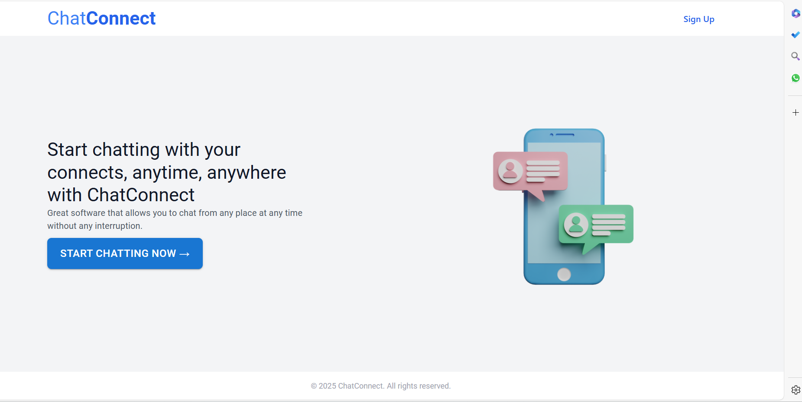
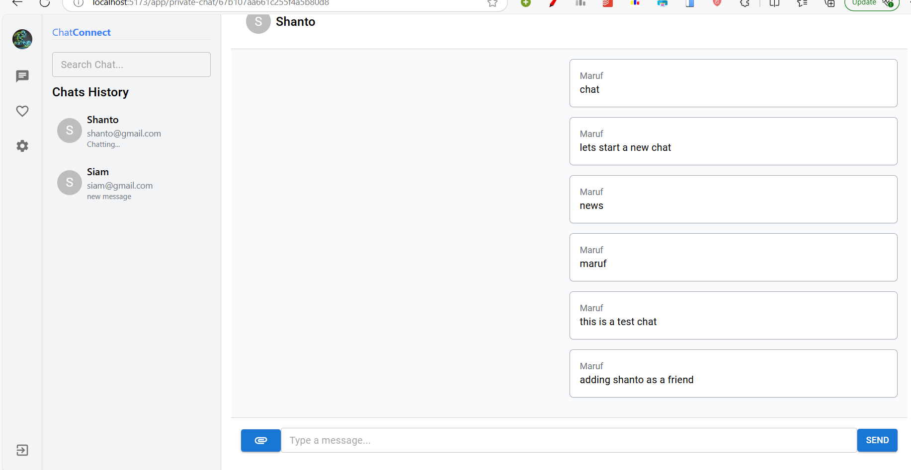

# Real-Time Chat Application

This is a real-time chat application built using **Node.js**, **Express**, **MongoDB**, and **Socket.IO**. It allows users to join chat rooms, send and receive messages in real-time, and manage chat history.

---

## Features

- **End-to-End Encryption**: Ensures secure messaging by encrypting messages between sender and receiver.
- **Cloudinary Integration**: Stores and manages multimedia files (images, videos) efficiently using Cloudinary.

- **User Authentication**: Secure login and registration with token-based authentication (JWT).
- **Private Chat**: One-on-one chat rooms for private communication.
- **Real-Time Messaging**: Instant message delivery using Socket.IO.
- **Message History**: Stores and displays previous messages in chat rooms.

---

## Technologies Used

- **Frontend**: React.js (or any frontend framework of your choice)
- **Backend**: Node.js, Express
- **Database**: MongoDB (with Mongoose for schema modeling)
- **Real-Time Communication**: Socket.IO
- **Authentication**: JSON Web Tokens (JWT)

---

## Prerequisites

Before running the project, ensure you have the following installed:

- **Node.js** (LTS version recommended)
- **MongoDB** (local installation or MongoDB Atlas for cloud hosting)
- **npm** (comes with Node.js)

---

## Installation

### 1. Clone the Repository

```bash
git clone https://github.com/yourusername/chat-application.git
cd chat-application
```

### 2. Install Backend Dependencies

```bash
npm install
```

### 3. Set Up Environment Variables

Create a `.env` file in the root directory and add the following:

```env
MONGO_URI=your_mongo_database_connection_string
JWT_SECRET=your_jwt_secret_key
PORT=3000
```

Replace `your_mongo_database_connection_string` with your MongoDB URI (e.g., from MongoDB Atlas).

### 4. Start the Server

```bash
npm start
```

The backend will run at `http://localhost:3000`.

---

## Frontend Setup (Optional)

If you're using a frontend framework like React.js:

### 1. Navigate to the Frontend Directory

```bash
cd frontend
```

### 2. Install Frontend Dependencies

```bash
npm install
```

### 3. Start the Frontend Application

```bash
npm start
```

The frontend will run at `http://localhost:3001`.

---

## Running with Docker (Optional)

### 1. Build the Docker Image

```bash
docker build -t chat-application .
```

### 2. Run the Container

```bash
docker run -p 3000:3000 chat-application
```

The app will be accessible at `http://localhost:3000`.

---

## Contributing

We welcome contributions! Here’s how you can help:

1. **Fork the repository.**
2. **Create a new branch** (`git checkout -b feature-name`).
3. **Make your changes and write tests.**
4. **Commit your changes** (`git commit -am 'Add new feature'`).
5. **Push to the branch** (`git push origin feature-name`).
6. **Create a Pull Request** with a description of your changes.

---

## License

This project is licensed under the MIT License. See the [LICENSE](LICENSE) file for details.

---

## Screenshots

### 1. Welcome Page


### 1. Chat Room Interface


---
## Acknowledgments

- **Socket.IO** for enabling real-time communication.
- **Mongoose** for simplifying MongoDB interactions.
- **Express** for its fast and lightweight web framework.
- **All contributors** and developers for their support.
